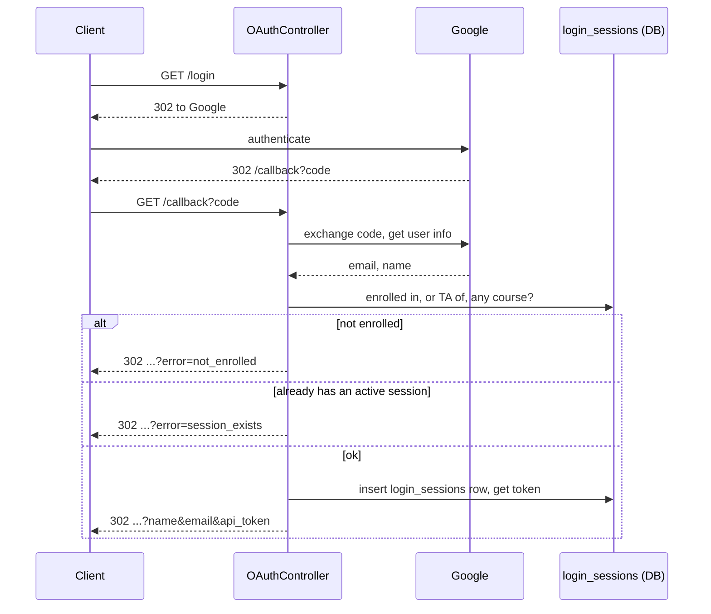
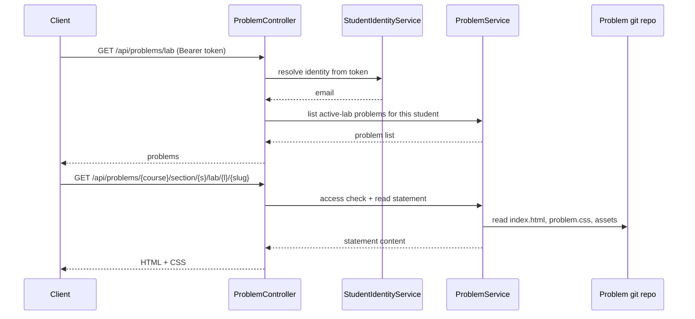
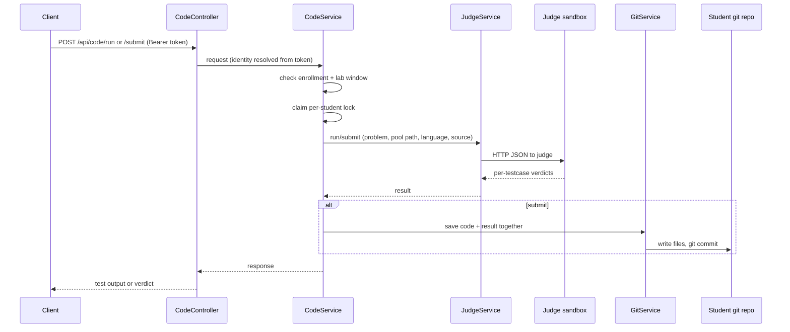
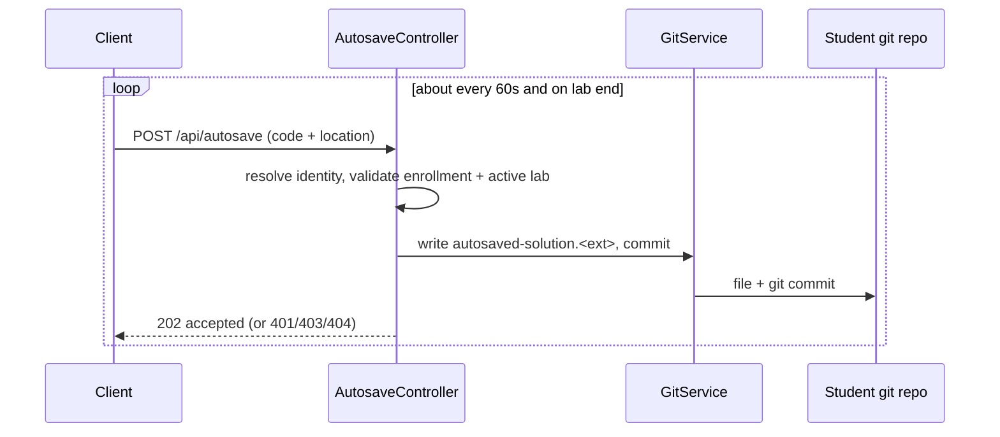
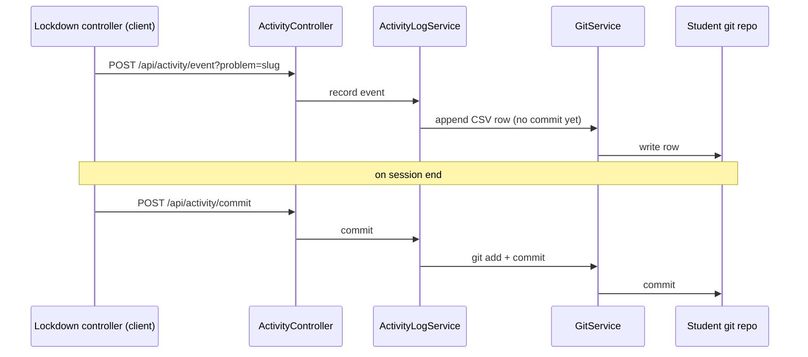

# Data flow

This page traces the main things a student does, request by request. Each flow is backed by the controllers and services described on the [components]() page.

## Login

Login is Google OAuth. The interesting parts are that the backend checks enrollment before issuing a token, refuses a second concurrent session, and hands the token back in the redirect URL.



A few details worth knowing:

- The OAuth request pins `hd=sjsu.edu`, so only SJSU accounts are offered.
- Membership is checked with `CourseAccessService.coursesFor`: enrolled as a student, or assigned as the course's TA. An account that is neither is turned away with `error=not_enrolled`. A TA gets `&role=ta` on the redirect so the client can label practice mode; the server never reads it back.
- One active session per student is enforced by `tokenStore.hasActiveSession`. A second login while one is active gets `error=session_exists`.
- Issuing the token is the `login_sessions` insert itself. If that write fails, login fails, because a token with no row could never resolve to a user.
- Web and desktop use the same flow. The desktop app passes an `app_callback` (a `localhost` URL) and a `state` value, and the backend redirects the token there instead of to `/`.

## Opening a problem

Once logged in, the client asks for the problems in the currently active lab, then fetches a specific problem's statement.



`ProblemService` enforces access on every read through `CourseAccessService`: the caller must be a member (enrolled student, or the course's TA), in the right section, the lab must be active (the TA is exempt from this — they may do any lab at any time), and the problem must belong to that lab. It reads statement files from the problem git repo and guards against path traversal. Relative image URLs in the statement are rewritten to point at the asset endpoint.

## Running and submitting code

`run` and `submit` share most of their path. The difference is what the judge grades against and whether the result is saved.



Things that matter here:

- Identity comes from the token. Any `studentEmail` in the request body is ignored.
- `CodeService` holds a per-student lock (an atomic claim keyed by the resolved email) shared between run and submit, so a fast double-click cannot fire two judge runs at once.
- The lab window is checked with `CourseAccessService.labDenialReason`. If the lab has not started or has ended, a student's request is rejected before reaching the judge; the course's TA is not held to the window.
- `run` sends the sample tests plus any custom inputs the student typed, and saves nothing.
- `submit` grades against all tests (sample and hidden). It calls the judge first, then saves the code and the result JSON together under `submissions/` so they share one timestamp. If the judge call fails, the student sees a generic error and nothing is graded.
- The language string from the course or request is mapped to a file extension (for the saved file) and to a judge language code (for the sandbox).

## Autosave

While a student edits, the client autosaves in the background about once a minute, and again when the lab ends.



If the client gets a 401 back, the session is gone and it stops the autosave loop.

## Proctoring (lockdown)

During a lab the client watches for focus loss, fullscreen exit, copy, paste, and devtools, and heartbeats. These events are queued on the client and drained to the backend, which appends them to a CSV. The CSV is committed to git when the session ends.

Every event is a `LockdownViolation(kind, timestampMs, detail)`. `ViolationKind` in `data/src/commonMain/kotlin/data/Lockdown.kt` is the single source of truth for which events are banner-worthy: **ALERT** shows the student a banner and is logged, **INFO** is logged for audit only.

| Kind | Severity | Source |
| --- | --- | --- |
| `LockdownStarted` | INFO | First event of every session. Confirms lockdown engaged |
| `LockdownEnded` | INFO | Final client event. Confirms the student ended the lab |
| `FocusLoss` | ALERT | Window blur, desktop and web |
| `FocusGained` | INFO | Recovery: window regained focus |
| `FullscreenExit` | ALERT | Web fullscreen released |
| `TabHidden` | ALERT | Web only. `visibilitychange` to hidden |
| `TabVisible` | INFO | Recovery: tab became visible again |
| `PasteFromOutside` | ALERT | Clipboard content did not match the last copy made in the editor |
| `CopyFromEditor` | INFO | Ctrl/Cmd+C or +X inside the editor. Logged, not alerted |
| `ContextMenu` | ALERT | Right-click suppressed |
| `DevToolsAttempt` | ALERT | F12, Ctrl-Shift-I, Cmd-Q, Alt-F4 and similar |
| `ClipboardEscape` | ALERT | Clipboard scrubbed on focus loss |
| `WindowRestored` | ALERT | Desktop only. Minimize was blocked and the window forced back to fullscreen |
| `Heartbeat` | INFO | 10-second tick, tagged `active` or `idle` |
| `HeartbeatGap` | INFO | Wall-clock gap over 1.5x the interval |
| `SessionSummary` | INFO | One event when lockdown stops |
| `LoggedOut` | INFO | Recorded by the server, not the client: session ended by explicit logout or TTL expiry |

`SessionSummary.detail` is one space-separated line, built in `LockdownEventService`:

```
durationMs=… outMs=… focusLosses=… tabHidden=… copiesFromEditor=…
pastesExternal=… fullscreenExits=… navAttempts=… maxHeartbeatGapMs=…
```

Those are the questions a lab asks after the fact: how long the student was out of the app, how often they switched away, whether they pasted foreign content, whether they tried to leave fullscreen or open devtools, and whether the heartbeat has suspicious gaps.



Session end also commits the log through a different path: when `ApiTokenStore` ends a session it publishes a `LogoutEvent`, and `LogoutActivityLogHook` commits the activity log in response. That listener runs synchronously before the session is marked logged out, so if the commit fails the logout is blocked rather than silently losing the log.
