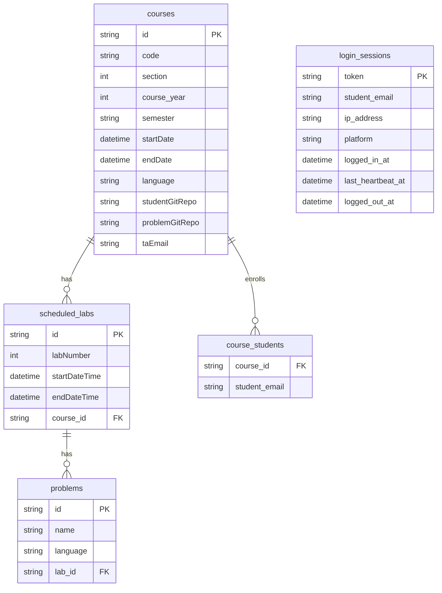

# Data model

CS30 keeps state in two places, and the split is deliberate:

- **The database** holds course structure and login sessions. This is the relational, queryable state.
- **Git repositories** hold student work and problem content. This is the file state: code, submissions, activity logs, and problem statements.

## Database

The JPA entities are in `backend/src/main/models/`. `Course`, `ScheduledLab`, and `Problem` are all in `Course.kt`; `LoginSession` is in `LoginSession.kt`.



Notes on the tables:

- **`courses`** carries the two git repo paths (`studentGitRepo`, `problemGitRepo`) as plain strings. These are filesystem paths on the server, which is why the backend has to run on the same host as the repos.
- **`course_students`** is an element-collection table, not an entity. It is just the set of enrolled student emails for a course.
- **A `ScheduledLab` is "active" when now is between its start and end times.** That is computed in code (a transient property), not stored. The lab window checks in `CodeService` and `ProblemService` rely on it.
- **`login_sessions` is the session store.** The primary key is the token. Every login inserts a new row, and old rows are kept with `logged_out_at` set, so the table is a full login history rather than a snapshot of current sessions. It is indexed by `student_email` because that is what most lookups use. `ip_address` is `request.remoteAddr`, which is only meaningful because the server terminates TLS directly with no proxy in front.

The schema is managed by Hibernate with `ddl-auto=update`. There is no Flyway or Liquibase. This has a real consequence for rollbacks: an older jar can expect a different schema than the one in the database, so rolling a jar back across a schema change is risky.

## Git storage

`GitService` writes and commits all student work. The layout inside the student git repo is:

```
section_<section>/
  lab_<labNumber>/
    <problemName>/
      <studentEmail>/
        autosaved-solution.<ext>            # latest in-progress code
        submissions/
          submission-<timestamp>.<ext>      # one per submit
          result-<timestamp>.json           # judge result for that submit
          bestsubmission.json               # metadata for the best result so far
  ActivityLogs/
    <date>/
      <studentEmail>_<date>_activity.csv    # proctoring events
```

The problem git repo is a flat pool keyed by problem name:

```
<problemName>/
  index.html          # the rendered statement
  problem.css
  assets/             # images and other statement assets
  data/               # test data
```

For the judge, the same problem pool must contain a `problem.yaml` and the test data under `data/sample/` and `data/secret/` (each case a `.in` and a `.ans`). The judge is pointed at this pool by path when the backend calls it, so the pool must contain the same problem IDs that the database knows about.

## The source of truth for course setup

Courses, labs, sections, and enrollments are defined in a YAML file and loaded through the CLI `addcourse` command. The database is populated from that YAML. There is a template at `templates/courseTemplate.yml` and a working example at `course.yaml` in the repo root. If you want to know the exact YAML shape, read `CourseInput` in `cli/src/main/Main.kt`, which is the class it deserializes into.
