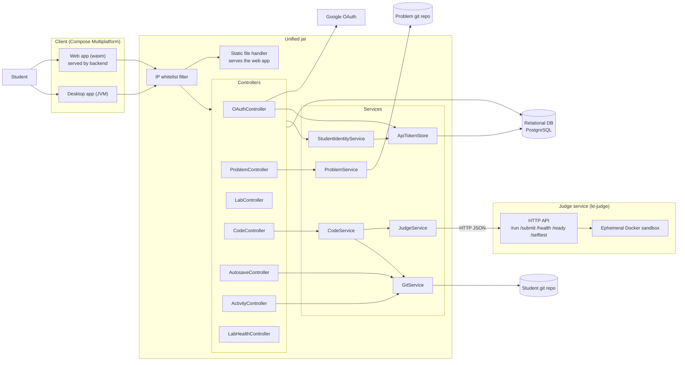

# Architecture overview

This page gives you the whole system on one page. The [components]() page breaks each part down, and the [data flow]() page walks through individual requests.

## The shape of it

There are three running pieces:

1. **The client**, which is the Compose Multiplatform frontend. The same code runs as a web app (compiled to wasm, served by the backend) and as a desktop app (a native JVM app the student installs).
2. **The unified jar**, which is the Spring Boot backend plus the CLI plus the compiled web frontend, all in one artifact. This serves the API and the web UI.
3. **The judge**, a separate service that runs student code inside a Docker sandbox. The backend talks to it over HTTP at `judge.url`.

Around those sit Google (for login), a relational database (PostgreSQL in production), the local git repositories where student work and problem statements live, and the Docker daemon that the judge uses.

## Component diagram

This diagram is drawn from the current source.

## The five things worth knowing early

**Everything after login is a Bearer token.** OAuth issues an API token. Every API call sends it as `Authorization: Bearer <token>`. The server always resolves identity from that token and never trusts an email in the request body. See [StudentIdentityService](#identity-and-sessions).

**Sessions live in the database.** Each login inserts a row in the `login_sessions` table. A client heartbeat every 60 seconds keeps the session alive; a session with no heartbeat for 2 minutes is considered expired. Only one active session per student is allowed. The store is the `login_sessions` table via `ApiTokenStore` and `LoginSessionRepository`, not an in-memory token map.

**Student work is stored in git, not in the database.** The database holds course structure (courses, labs, problems, enrollments, sessions). The actual student code, submissions, and activity logs are written as files into a git repository and committed. See the [data model]() page for the exact layout.

**The judge is isolated and separate.** The backend never runs student code itself. It sends the code to the judge over HTTP, and the judge runs it in a throwaway Docker container with no network, a read-only root filesystem, dropped capabilities, and memory/CPU/process limits.

**Run and submit are different.** `run` executes against sample tests plus any custom input the student typed, and saves nothing. `submit` grades against all tests including hidden ones, and saves the code and the result together into the student git repo. Both are blocked if the lab window is closed.

