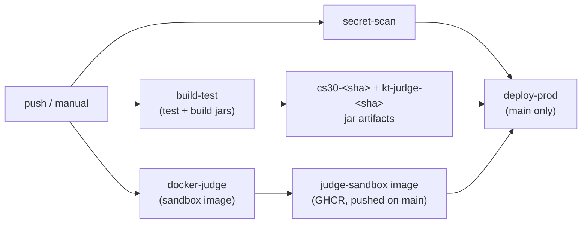

# CI/CD

One pipeline, GitHub Actions, defined in `.github/workflows/ci.yml`. It runs on every push to any branch and can be triggered manually (`workflow_dispatch`). Runs for the same ref cancel each other (`concurrency: ci-<ref>`, `cancel-in-progress: true`), so only the latest push on a branch keeps running.

## The jobs

Four jobs. `secret-scan`, `build-test`, and `docker-judge` run in parallel. `deploy-prod` waits on all three (`needs: [build-test, secret-scan, docker-judge]`) and only runs on `main`.

### secret-scan

Runs `gitleaks` against full history (`fetch-depth: 0`, then `gitleaks detect --source . --no-banner --redact`). The version is pinned (`GITLEAKS_VERSION=8.30.1`) and the binary is downloaded from the GitHub release — not scraped from "latest" — so scans are reproducible.

### build-test

GitHub-hosted runner, JDK 21 (Temurin), `gradle/actions/setup-gradle`:

1. `./gradlew test` — all module tests.
2. `./gradlew :cli:bootJar` — the unified backend/CLI jar → `cli/build/libs/cs30-<version>.jar`.
3. `./gradlew :kt-judge:bootJar` — the judge jar → `kt-judge/build/libs/kt-judge.jar`.
4. Uploads test reports (14 days).
5. Uploads `cs30-<sha>` (from `cli/build/libs/cs30-*.jar`, a glob so a version bump doesn't break it) and `kt-judge-<sha>` (from `kt-judge/build/libs/kt-judge.jar`), both kept 30 days. These are the exact artifacts `deploy-prod` downloads.

### docker-judge

Builds the judge sandbox image (`kt-judge/sandbox/`). A `paths-filter` first checks whether anything under `kt-judge/sandbox/**` changed; if nothing changed it does nothing. When it does build, it only **pushes** on `main`, to GitHub Container Registry, tagged `ghcr.io/sjsu-cs-systems-group/judge-sandbox:latest` and `:<sha>` (uses the GHA layer cache). The owner in the tag must be lowercase — GHCR rejects mixed case.

### deploy-prod

Runs only on `main`, only after the other three succeed, on the self-hosted runner on production (`runs-on: [self-hosted, cs30-prod-v2]`), using the `production` GitHub environment (where `PROD_DB_PASSWORD` and `PROD_GOOGLE_CLIENT_SECRET` live). It has its own `concurrency: deploy-prod` with `cancel-in-progress: false`, so a new push to main **queues** behind an in-flight deploy instead of killing it mid-swap. `APP_ROOT=/opt/cs30`. Steps:

1. Download the `cs30-<sha>` and `kt-judge-<sha>` jar artifacts.
2. **Sync config**: `cp deploy/application.properties /opt/cs30/application.properties`. `cp` (not `install`) on purpose — it overwrites content only and preserves the file's server-set owner/group/mode. CI never sets permissions; the server owns them. See [deployment configuration]().
3. **Write secrets**: `umask 077`, write `/opt/cs30/cs30.env` from the two secrets, `chmod 0600`.
4. **Pull the judge image**: `docker login ghcr.io` (with the job's `GITHUB_TOKEN`, `packages: read`), then `docker pull ghcr.io/sjsu-cs-systems-group/judge-sandbox:latest`. Non-fatal — a pull failure logs a warning and never blocks the backend deploy.
5. **Deploy the release**: `cp` both jars into `releases/<sha>/`, flip the `current` symlink. Restart the judge **first** (non-fatal: poll `:8000/health` then `:8000/ready`, warn but continue on failure — the backend calls the judge on startup). Then restart the backend — **this is the deploy gate**: poll the backend health endpoint on 443, and if it never comes up, `rollback()` flips `current` back to the previous release and restarts **both** services.
6. Prune old releases, keeping the last 5.

The operator's view of a deploy is on the [deployment overview]().

## What controls what merges and deploys

- **Feature branches** get `secret-scan`, `build-test`, and (if `kt-judge/sandbox/**` changed) a judge image **build** — but no GHCR push and no deploy. To try a feature build, download its jar artifact from the Actions run and run it yourself.
- **`main`** additionally runs `deploy-prod`. A merge to main ships to production.
- **Branch protection on `main`** requires a PR with at least one approval and passing checks. Because `deploy-prod` now lists `secret-scan` in `needs`, a leaked secret blocks the deploy directly (not only via branch protection).
