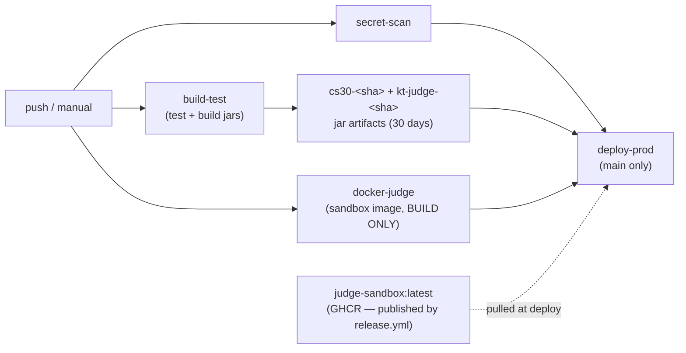
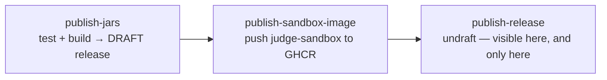

# CI/CD

Two workflows:

- **`.github/workflows/ci.yml`** — builds and tests every push, and deploys `main` to production. It publishes nothing: no jars outside Actions artifacts, no images to GHCR.
- **`.github/workflows/release.yml`** — publishes both jars and the judge sandbox image when you push a `v*` tag. It deploys nothing.

Everything published carries the version of the tag that built it.

CI runs on every push to any branch and can be triggered manually (`workflow_dispatch`). It skips docs-only pushes (`paths-ignore: docs/**`, handled by `docs.yml`) and tag pushes (`tags-ignore: '**'`, handled by `release.yml`). Runs for the same ref cancel each other (`concurrency: ci-<ref>`, `cancel-in-progress: true`), so only the latest push on a branch keeps running.

## The jobs



Four jobs. `secret-scan`, `build-test`, and `docker-judge` run in parallel. `deploy-prod` waits on all three (`needs: [build-test, secret-scan, docker-judge]`) and only runs on `main`.

The dashed edge is the sandbox image. `deploy-prod` still pulls it, but no job here produces it.

### secret-scan

Runs `gitleaks` against full history (`fetch-depth: 0`, then `gitleaks detect --source . --no-banner --redact`). The version is pinned (`GITLEAKS_VERSION=8.30.1`) and the binary is downloaded from the GitHub release — not scraped from "latest" — so scans are reproducible.

### build-test

GitHub-hosted runner, JDK 21 (Temurin), `gradle/actions/setup-gradle`:

1. `./gradlew test` — all module tests.
2. `./gradlew :cli:bootJar` — the unified backend/CLI jar → `cli/build/libs/cs30-<version>.jar`.
3. `./gradlew :kt-judge:bootJar` — the judge jar → `kt-judge/build/libs/kt-judge.jar`.
4. Uploads test reports (14 days).
5. Uploads `cs30-<sha>` (from `cli/build/libs/cs30-*.jar`, a glob so a version bump doesn't break it) and `kt-judge-<sha>` (from `kt-judge/build/libs/kt-judge.jar`), both kept 30 days. These are the exact artifacts `deploy-prod` downloads.

### docker-judge

Builds the judge sandbox image (`kt-judge/sandbox/`) and never pushes it. A `paths-filter` first checks whether anything under `kt-judge/sandbox/**` changed; if nothing changed it does nothing. When it does build, it tags the result `judge-sandbox:ci`, a local name thrown away with the runner.

This job is a build check — it catches a broken Dockerfile before the PR merges. It has no `packages: write` permission and never logs in to GHCR, so it cannot publish even by mistake. [Publishing a release](#publishing-a-release) does that. Both jobs share the same `type=gha` layer cache, so the release build reuses these layers when the sandbox hasn't changed.

### deploy-prod

Runs only on `main`, only after the other three succeed, on the self-hosted runner on production (`runs-on: [self-hosted, cs30-prod-v2]`), using the `production` GitHub environment (where `PROD_DB_PASSWORD` and `PROD_GOOGLE_CLIENT_SECRET` live). It has its own `concurrency: deploy-prod` with `cancel-in-progress: false`, so a new push to main **queues** behind an in-flight deploy instead of killing it mid-swap. `APP_ROOT=/opt/cs30`. Steps:

1. Download the `cs30-<sha>` and `kt-judge-<sha>` jar artifacts.
2. **Sync config**: `cp deploy/application.properties /opt/cs30/application.properties`. `cp` (not `install`) on purpose — it overwrites content only and preserves the file's server-set owner/group/mode. CI never sets permissions; the server owns them. See [deployment configuration]().
3. **Write secrets**: `umask 077`, write `/opt/cs30/cs30.env` from the two secrets, `chmod 0600`.
4. **Pull the judge image**: `docker login ghcr.io` (with the job's `GITHUB_TOKEN`, `packages: read`), then `docker pull ghcr.io/sjsu-cs-systems-group/judge-sandbox:latest`. Non-fatal — a pull failure logs a warning and never blocks the backend deploy. `:latest` only moves when a release is published, so this pull can fetch an image older than the commit being deployed. See [sandbox image timing](#sandbox-image-timing).
5. **Deploy the release**: `cp` both jars into `releases/<sha>/`, flip the `current` symlink. Restart the judge **first** (non-fatal: poll `:8000/health` then `:8000/ready`, warn but continue on failure — the backend calls the judge on startup). Then restart the backend — **this is the deploy gate**: poll the backend health endpoint on 443, and if it never comes up, `rollback()` flips `current` back to the previous release and restarts **both** services.
6. Prune old releases, keeping the last 5.

The operator's view of a deploy is on the [deployment overview]().

## Publishing a release

`release.yml` runs on a `v*` tag push (or `workflow_dispatch` with a version input). It publishes both jars and the judge sandbox image. It has no deploy step, so publishing a release does not change what production runs.

```bash
git tag v1.2.3 && git push origin v1.2.3
```

Three jobs, each waiting on the one before it. The release is built as a draft and only made visible after the image push succeeds, so a failed Docker build cannot leave jars published without a matching sandbox image:



### publish-jars

1. **Resolve the version** from `${GITHUB_REF_NAME#v}` (or the dispatch input, passed through `env:` so it can't be interpolated into the shell) and reject anything that isn't `1.2.3` / `1.2.3-rc1`.
2. `./gradlew test :cli:bootJar :kt-judge:bootJar -PreleaseVersion=<version>`. That property is the only thing that overrides the modules' `1.0-SNAPSHOT`; it also lands in each jar's `Implementation-Version`, so you can identify a jar with `unzip -p cs30.jar META-INF/MANIFEST.MF`. Tests run first, so a failing test means no release at all.
3. `gh release create --draft --generate-notes` with `cs30.jar`, `kt-judge.jar` and `SHA256SUMS.txt`. A draft is invisible on the Releases page and its assets are not downloadable.

### publish-sandbox-image

Builds `kt-judge/sandbox/` and pushes to GHCR. It builds every time, with no paths-filter: a release needs an image for its own version even if the sandbox hasn't changed in months. Three tags:

| Tag | Purpose |
|---|---|
| `:v1.2.3` | Immutable. A release always resolves to the same image. |
| `:<sha>` | Traces an image back to its commit. |
| `:latest` | What `deploy-prod` pulls. Skipped for prereleases. |

Prereleases skip `:latest` on purpose. `deploy-prod` pulls `:latest` on every merge to `main`, so an `-rc` tag claiming it would push an untested sandbox into production without anyone deploying it.

### publish-release

Runs `gh release edit --draft=false`. The release becomes visible and downloadable here and nowhere earlier. `--draft=false` is the only flag passed, so a prerelease stays a prerelease.

If any job fails the release stays a draft, so nothing is ever half-visible. Retrying means deleting the draft first (`gh release delete v1.2.3`), because `gh release create` refuses to overwrite an existing release, draft or not. Delete the remote tag too if you want to reuse the version number.

### Consuming a release

Asset names are fixed and carry no version, so the download URL stays the same across releases. The repo is public, so no token is needed:

```bash
curl -LO https://github.com/SJSU-CS-systems-group/cs30/releases/latest/download/cs30.jar
```

A tag with a suffix (`v1.2.3-rc1`) publishes as a prerelease, so it stays out of `/releases/latest`.

## Sandbox image timing

Only a release publishes the sandbox image. Merging a sandbox change to `main` builds it in `docker-judge` but pushes it nowhere, so `deploy-prod` keeps pulling the old `:latest` and production keeps running the old sandbox.

**Change the sandbox, tag a release.** Otherwise the change never reaches production. Jar-only changes deploy on merge as before.

The trade is that jars and sandbox image carrying the same version are built from the same commit and stay together.

## What controls what merges, deploys and publishes

- **Feature branches** get `secret-scan`, `build-test`, and (if `kt-judge/sandbox/**` changed) a judge image build — no GHCR push, no deploy. To try a feature build, download its jar artifact from the Actions run and run it yourself.
- **`main`** additionally runs `deploy-prod`. A merge ships the jars to production and publishes nothing — no GitHub Release, no GHCR image.
- **A `v*` tag** publishes both jars and the sandbox image, and deploys nothing. `ci.yml` ignores tag pushes (`tags-ignore: '**'`), so tagging does not run the pipeline twice.
- **Branch protection on `main`** requires a PR with at least one approval and passing checks. Because `deploy-prod` lists `secret-scan` in `needs`, a leaked secret blocks the deploy directly (not only via branch protection).

Merging deploys. Tagging publishes. Neither does the other.
