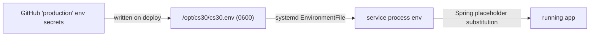

# Configuration

Both apps read one shared file, `deploy/application.properties` in the repo. On each deploy the workflow copies it to `/opt/cs30/application.properties`, so the repo file is the source of truth for all non-secret config.

Both services load that deployed file explicitly:

- **Backend** (`cs30.service`): `-Dspring.config.additional-location=file:/opt/cs30/application.properties` on the `java` command.
- **Judge** (`kt-judge.service`): `--spring.config.additional-location=file:/opt/cs30/application.properties`.

This matters for the judge: without that flag it silently ignores the deployed file and falls back to the compiled-in default `judge-sandbox:latest` for `judge.image`, so it would run the wrong sandbox image. The flag is what makes the judge use the GHCR image. (The file is also bundled into each jar at build time via `from("../application.properties")`, but the external file overrides it.)

## Where secrets come from

Secrets are never in the properties file and never in git. The file has placeholders (`${DB_PASSWORD}`, `${GOOGLE_CLIENT_SECRET}`) that Spring fills from environment variables at startup.

The two secrets are `PROD_DB_PASSWORD` and `PROD_GOOGLE_CLIENT_SECRET` (GitHub → Settings → Environments → production). Each deploy writes them to `/opt/cs30/cs30.env` with `umask 077` (mode `0600`); the systemd unit loads that file as its `EnvironmentFile`. To rotate a secret: update it in GitHub, redeploy.

## The settings in `deploy/application.properties`

| Key | Value | Meaning |
| --- | --- | --- |
| `server.port` | `443` | Backend HTTPS port (bound directly; no proxy) |
| `app.timezone` | `America/Los_Angeles` | App timezone (`AppTimeZoneService`) |
| `server.ssl.enabled` | `true` | The app terminates TLS itself |
| `server.ssl.certificate` | `/etc/ssl/cs30/fullchain.pem` | TLS cert |
| `server.ssl.certificate-private-key` | `/etc/ssl/cs30/privkey.pem` | TLS key |
| `server.compression.*` | — | Compress HTML/CSS/JS/JSON/wasm/SVG over 1 KB |
| `spring.datasource.url` | `jdbc:postgresql://localhost:5432/cs30db` | Local Postgres |
| `spring.datasource.username` | `cs30` | DB user |
| `spring.datasource.password` | `${DB_PASSWORD}` | From env (secret) |
| `spring.jpa.hibernate.ddl-auto` | `update` | Hibernate manages schema; no migration tool |
| `google.client-id` | (literal) | OAuth client id (not secret) |
| `google.client-secret` | `${GOOGLE_CLIENT_SECRET}` | From env (secret) |
| `google.redirect-uri` | `https://sjsu.cs30.app/callback` | Must match the Google console exactly |
| `judge.url` | `http://localhost:8000` | Where the backend reaches the judge |
| `judge.image` | `ghcr.io/sjsu-cs-systems-group/judge-sandbox:latest` | Sandbox image the judge runs per submission |
| `judge.sandbox.memory-mb` | `2560` | Per-container memory cap. Overrides the `1024` code default |
| `judge.limits.max-custom-cases` | `3` | Custom stdins one `/run` accepts. Overrides the `10` code default |
| `server.servlet.session.timeout` | `1h` | Servlet HTTP session (OAuth round-trip only) |
| `cs30.backend.url` | `https://sjsu.cs30.app` | Base URL the frontend calls |
| `cs30.allowed-ips` | (empty) | CIDR allowlist; empty = allow all |
| `docker.path` | `/usr/bin/docker` | Docker binary the backend uses for git ops |
| `bt.path` | `bt` | bapctools binary; `addproblem` runs `bt upgrade` on the pool copy |
| `canvas.url` | `https://sjsu.instructure.com` | Canvas instance the sync commands talk to |
| `canvas.token` | (empty) | Canvas API token; set via `CANVAS_TOKEN`, never commit it |
| `editor.max-custom-test-cases` | `1` | Custom inputs the editor allows on a run |

Dead keys: `git.server.ssh-host` and `git.server.ssh-user` are in the file but **no code reads them** — they only appear in old script comments. Ignore them.

## Judge settings (`judge.*`, bound by `JudgeProperties`)

The judge reads these from the same file. The values below are the **compiled-in defaults** from `JudgeProperties.kt`, which apply when the key is absent — `deploy/application.properties` overrides two of them, marked inline and listed in the table above.

- `judge.port=8000` — the judge's own HTTP port (a `JudgePortCustomizer` applies it, overriding `server.port` so the judge and backend can share one file).
- `judge.image` — sandbox image (see table).
- `judge.sandbox.*` — container limits: `memoryMb=1024` (**prod sets `2560`**), `cpus=1.0`, `pidsLimit=256`, `fsizeBytes=33554432`, `workTmpfsMb=512`, `tmpTmpfsMb=128`, `uid=1000`, `group=""`. `judge.sandbox.group` is a host group **name**; the judge resolves its GID via `getent` at runtime and runs the container as that gid so it can read the problem pool (set it to `cs30problems` in prod).
- `judge.concurrency.maxWorkers` (defaults to CPU count), `judge.concurrency.maxQueueSize=100`.
- `judge.timeouts.runAllWallSeconds=60`.
- `judge.limits.maxCustomCases=10` (**prod sets `3`**). Note the editor separately allows only `editor.max-custom-test-cases` inputs per run.
- `judge.languages` — extension map (`c/.c`, `cpp/.cpp`, `java/.java`, `python/.py`).

## Backend keys with defaults (not in the file)

These have compiled-in defaults and are only set if you add them:

- `git.repos.base-path` (default `/var/git/courses`), `git.server.email` (`server@cs30.edu`), `git.server.name` (`CS30 Server`) — used by `GitService`.
- `backup.directory` (`/var/backups/cs30-db`), `backup.retain-days` (`7`), `backup.enabled` (`true`) — `DatabaseBackupService`.

## Things to keep straight

- **Two session timeouts.** `server.servlet.session.timeout` is the servlet HTTP session, used only for OAuth bookkeeping. The login session that matters for API calls has its own heartbeat TTL in `ApiTokenStore` — not the same thing.
- **`cs30.allowed-ips` empty = open.** The `IpWhitelistFilter` allows everything when the list is blank. For campus-only access, put the lab CIDRs here. The value is a comma-separated list of CIDRs or exact addresses, so `130.65.254.0/24` covers a lab subnet and single addresses can be appended for staff. To find the right value, load the site from a machine on the target network: the blocked page reports the IP the server actually received, which is the one to allow. Use that rather than what the client believes its address is — a NAT or proxy in between changes it.
- **`spring.jpa.open-in-view` stays `false`.** Spring's default (`true`) holds a Hibernate session open for the whole request, which hides missing eager fetches until the app is under real concurrent load. That is how a `LazyInitializationException` first reached production. With it off, any code touching a lazy association must fetch it explicitly in a transactional repository method. See [the runbook](#troubleshooting).
- **Redirect URI must match Google exactly.** Change the host or port and you must update the redirect URI in Google Cloud, or login breaks.
