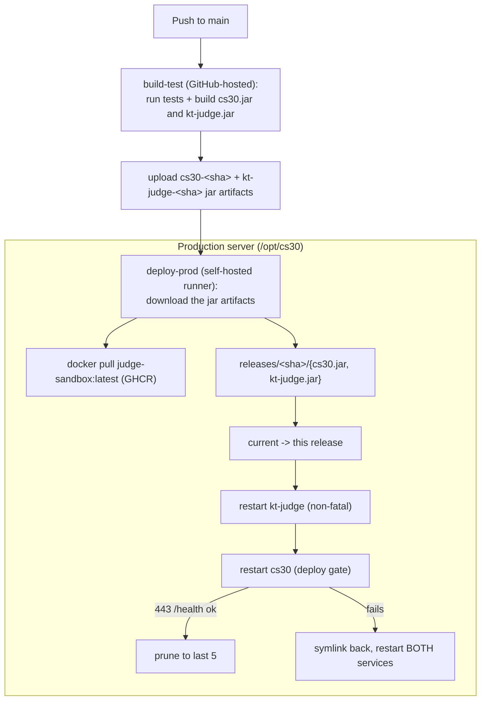

# Deployment overview

Internal doc. Describes how production actually runs today, taken from the code and the deploy workflow, not from older notes.

## What runs where

Production is a single campus Linux server (server 7, `cs-reed-07`), reachable from the campus network at `sjsu.cs30.app`. No Kubernetes, no docker-compose, no reverse proxy. The backend terminates TLS itself and binds port 443 directly. The pieces:

- **Backend** — the unified `cs30.jar`, run by the `cs30.service` systemd unit as user `cs30backend`. Listens on **443** over HTTPS and serves the API and the bundled web frontend. It's a non-root user, so the unit grants `AmbientCapabilities=CAP_NET_BIND_SERVICE` to let it bind the privileged port.
- **Judge** — `kt-judge.jar`, run by the `kt-judge.service` unit as user `cs30judge`, listening on **8000** (localhost only). It grades a submission by running the `judge-sandbox` Docker image in a throwaway container, so its unit has `After=docker.service` / `Requires=docker.service` and `cs30judge` is in the `docker` group.
- **PostgreSQL** — local on the same host.
- **Git repositories** — the problem pool and student repos live on the host filesystem; the backend writes to them directly.
- **GitHub Actions self-hosted runner** — runs on the server as `github-runner`, so deploys happen locally with no SSH or inbound access from GitHub's cloud.

The backend calls the judge at `judge.url` (`http://localhost:8000`) on startup and for every submission.

## How a release gets there



Build runs on a GitHub-hosted runner; deploy runs on the self-hosted runner on the server (the only one that can reach the campus network and local systemd). The deploy is a file copy, a symlink flip, and service restarts. Full pipeline on the [CI/CD]() page.

## On-server layout

```
/opt/cs30/
  current                 # symlink to the active release
  releases/<sha>/         # one dir per deployed release (last 5 kept)
    cs30.jar
    kt-judge.jar
  application.properties  # config, content overwritten from the repo each deploy
  cs30.env               # secrets (DB password, Google client secret), mode 0600

/etc/ssl/cs30/
  fullchain.pem          # TLS cert (referenced by application.properties)
  privkey.pem

/etc/systemd/system/
  cs30.service           # backend unit (user cs30backend)
  kt-judge.service       # judge unit (user cs30judge)
```

The tracked `deploy/cs30.service` and `deploy/kt-judge.service` are reference copies. The units that actually run are the installed ones under `/etc/systemd/system/`; if you change a unit, edit the installed one and `daemon-reload`.

## The release model

A release is a directory named after the git SHA holding both jars. `current` points at the live release. Deploying = new release dir → point `current` at it → restart the judge, then the backend. Rolling back = point `current` at an older release and restart both. The deploy keeps the last 5 release dirs.

Rollback only reverts the **jars**, not the database. Schema is managed by Hibernate `spring.jpa.hibernate.ddl-auto=update`, so rolling back across a schema change can leave the DB ahead of the code — check what changed before rolling back over a migration. It also does not revert the judge sandbox image (the deploy pulls the mutable `:latest` tag).

## Permissions model

CI never sets file permissions — the deploy job copies content with `cp` (not `install`), so it preserves whatever owner/group/mode the server already set. Permissions are owned by the server and set once by two scripts:

- `scripts/setup-service-users.sh` — creates the `cs30backend` and `cs30judge` users and the `cs30problems` group, puts `cs30judge` in `docker`, and sets the deploy dir `/opt/cs30` to root-owned with per-user ACLs granting `cs30backend` and `cs30judge` read (plus default ACLs so copied-in jars/config inherit read).
- `scripts/grant-pool-access.sh` — ACLs on the problem pool and student repos: `cs30backend` gets read/write (it owns and commits them), and `cs30problems` gets read on the pool (the judge sandbox container runs as that group's gid to read problems). The student repo is backend-only.

`cs30problems` is the pool-reader / container group; it is not what makes the deploy dir readable (that's the per-user ACLs above).

## Prerequisites set up once on the server

Done once, listed so you know they exist:

- Service users, group, docker membership, and `/opt/cs30` ACLs — `scripts/setup-service-users.sh`.
- Problem pool / student repo ACLs — `scripts/grant-pool-access.sh` (with `judge.sandbox.group=cs30problems` in `application.properties`).
- `cs30.service` has `AmbientCapabilities=CAP_NET_BIND_SERVICE` so `cs30backend` can bind 443.
- Both systemd units installed under `/etc/systemd/system/` and enabled.
- The runner's `GITHUB_TOKEN` can read the private `judge-sandbox` GHCR package (package linked to the repo, or made readable), and `github-runner` is in the `docker` group.
- TLS cert at `/etc/ssl/cs30/` — `fullchain.pem` and `privkey.pem`, matching the `server.ssl.*` keys. Let's Encrypt tooling writes these for you (certbot, or lego under `/etc/lego/certificates/`); copy or symlink them to `/etc/ssl/cs30/` and make them readable by `cs30backend`. Renewal must land in the same place or TLS breaks silently at the next restart. Port 443 open in the firewall (`sudo ufw allow 443`), along with SSH.
- Google OAuth redirect URI `https://sjsu.cs30.app/callback` registered in Google Cloud.
- PostgreSQL and JDK 21 installed, with a role and database matching the `spring.datasource.*` keys in [configuration]() — by default the `cs30` role owning `cs30db`:

  ```bash
  sudo -u postgres psql
  CREATE USER cs30 WITH PASSWORD '<the PROD_DB_PASSWORD secret>';
  CREATE DATABASE cs30db OWNER cs30;
  ```

  There is no migration tool: Hibernate creates the tables on first start via `ddl-auto=update`, so an empty database is the correct starting point.

No kernel tuning is required. `fs.pipe-user-pages-soft` was investigated as a cause of interactive-problem failures and ruled out — see [the runbook](#interactive-problems-under-concurrency).
